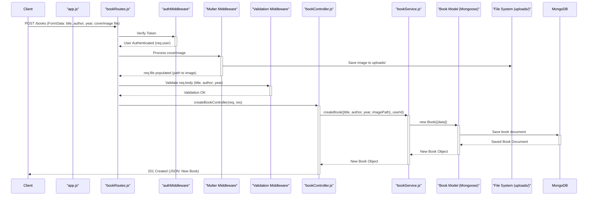

# Bookstore App 📚

A Node.js application for managing books, featuring user authentication, CRUD operations for books, cover image uploads, and role-based access control.

## Features

- **User Authentication**: Secure registration and login using JWT.
- **Role-Based Access Control**: Differentiates between `user` and `admin` roles, with admins having extended privileges (e.g., deleting any book).
- **Book Management (CRUD)**:
  - Users can create, read, and update their own books.
  - Admins can read all books and delete any book.
- **Cover Image Uploads**: Users can upload cover images for books, which are stored locally.
- **Input Validation**: Robust validation for user registration, login, and book data.
- **Comprehensive API Testing**: Includes integration tests using Vitest and Supertest.
- **Interactive UI**: A basic `index.html` is provided for interacting with the API directly from the browser.

## Tech Stack

- **Backend**: Node.js, Express.js
- **Database**: MongoDB (with Mongoose ODM)
- **Authentication**: JSON Web Tokens (JWT), bcryptjs for password hashing
- **File Uploads**: Multer (for local storage)
- **Request Logging**: Morgan
- **Input Validation**: `express-validator`
- **Testing**: Vitest, Supertest
- **Environment Management**: `dotenv`

## Project Structure

```
.
├── controllers/        # Request handlers, business logic layer
│   ├── authController.js
│   └── bookController.js
├── middleware/         # Express middleware
│   ├── authMiddleware.js
│   ├── authorizeMiddleware.js
│   ├── requestLogger.js
│   ├── validationResultHandler.js
│   └── validationRules.js
├── models/             # Mongoose schemas
│   ├── book.js
│   └── user.js
├── node_modules/       # NPM packages
├── routes/             # API route definitions
│   ├── authRoutes.js
│   └── bookRoutes.js
├── services/           # Business logic and database interaction layer
│   ├── bookService.js
│   └── userService.js
├── test-assets/        # Assets for testing (e.g., dummy images)
├── uploads/            # Directory for uploaded cover images (gitignored)
├── .env                # Environment variables (gitignored)
├── .gitignore          # Specifies intentionally untracked files
├── app.js              # Express application setup
├── app.test.js         # Integration tests
├── index.html          # Simple UI for API interaction
├── package.json
├── package-lock.json
└── readme.md           # This file
```

## Data Flow: Create Book with Image

This sequence diagram shows the data flow when a user creates a new book with a cover image.



## Installation

1.  **Clone the repository**:

    ```bash
    git clone https://github.com/mosaleh-dev/bookstore-app.git
    cd bookstore-app
    ```

2.  **Install dependencies**:

    ```bash
    npm install
    ```

3.  **Set up environment variables**:
    Create a `.env` file in the root directory of the project and add the following variables. Replace placeholder values with your actual configuration.

    ```env
    # MongoDB Connection URI
    MONGODB_URI="mongodb+srv://<user>:<password>@<your-cluster-url>/<database-name>?retryWrites=true&w=majority"

    # JWT Secret for signing tokens
    JWT_SECRET="your_super_secret_jwt_key_here"

    # (Optional) JWT Token Expiration Time (e.g., 1h, 7d)
    # JWT_EXPIRES_IN="1h"

    # (Optional) Port for the application
    # PORT=3000
    ```

    **Important**: Ensure your `MONGODB_URI` points to your MongoDB instance and `JWT_SECRET` is a strong, unique secret.

4.  **Ensure `uploads` directory exists**:
    The application will attempt to create an `uploads` directory in the project root if it doesn't exist. This directory is used for storing book cover images.

## Scripts

- **Start the application in development mode** (with Nodemon for auto-restarts):

  ```bash
  npm run dev
  ```

  The server will typically start on `http://localhost:3000`.

- **Start the application in production mode**:

  ```bash
  npm start
  ```

- **Run tests**:
  ```bash
  npm test
  ```
  This will execute the integration tests using Vitest. Test coverage reports are generated in the `coverage/` directory.

## API Endpoints

(A brief overview, refer to `routes/` and `app.test.js` for details)

### Authentication (`/auth`)

- `POST /register`: Register a new user.
- `POST /login`: Log in an existing user, returns a JWT.

### Books (`/books`)

_Requires authentication (JWT in Authorization header: `Bearer <token>`)._

- `POST /`: Create a new book. (Image upload via `coverImage` field in FormData)
- `GET /`: Get books.
  - Regular users: Get their own books.
  - Admin users: Get all books.
- `GET /:id`: Get a specific book by ID.
  - Users can only get their own books.
  - Admins can get any book.
- `PUT /:id`: Update a book by ID. (Image update/removal via `coverImage` field)
  - Users can only update their own books.
  - Admins can update any book.
- `DELETE /:id`: Delete a book by ID.
  - **Admin only**.

## Testing the API

- **Automated Tests**: Run `npm test` to execute the Vitest integration tests. These cover various scenarios including authentication, CRUD operations, role permissions, and file uploads.
- **Manual Testing (UI)**: Open `index.html` in your browser. This simple UI allows you to register, log in, and perform book management operations by interacting directly with the API. Ensure the API server (`npm run dev` or `npm start`) is running.

## Feedback

I value your feedback! Please let me know if you have suggestions or improvements for the test cases and edge cases covered in this project.
